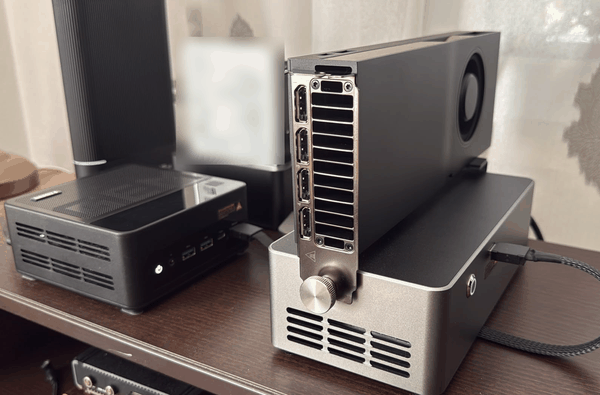

# Configuration

On the left is the AOOSTAR GEM12+ Pro — the model storage is there. 
On the right - RTX PRO 4500 — sits in a dock of its own. 
The OCuLink link in between is the reason several pages here talk about
what crosses the cable and when.

| | |
|---|---|
| GPU | NVIDIA RTX PRO 4500 Blackwell, 32 GB (32 623 MiB usable) |
| GPU power cap | 200 W |
| ECC | on |
| Attachment | **OCuLink external dock** |
| Driver | 610.57.04, CUDA 13 |
| Host | AOOSTAR GEM12+ Pro |
| CPU | AMD Ryzen 7 PRO 8845HS, 8 cores / 16 threads |
| CPU power target | 35 W, set in the BIOS |
| Memory | 96 GB DDR5-5600 |
| Model storage | 2 x internal NVMe (Lexar NM790 4TB) |

The [OCuLink](glossary.md#oculink) cable is a slow connection, providing around 8 GB/s of transfer rate.

**Inference is unaffected.** Once a model is loaded its weights are in VRAM and
stay there. Nothing crosses the cable while the model is answering, so none of
the throughput or quality figures in this repository are influenced by it.

**Loading is affected.** Weights are copied from system memory to the card over
that link, so load times include it.

**Splitting a model across card and system memory is a bad idea here.** In that
arrangement data crosses the cable for every token generated. While for llama.cpp
it may work for some configurations (llama.cpp moves the computing next to the
data), for vLLM the splitting is unusable, since vLLM moves tons of data through
that cable on every operation (the data migrates to the compute). The cost is
measured in [loading.md](loading.md#a-model-larger-than-the-card).

## Software

| | |
|---|---|
| Host OS | Proxmox VE |
| Engines run in | an unprivileged LXC container |
| llama.cpp | build b10447 |
| vLLM | 0.26.1rc1.dev949 (nightly) |
| Manager | [AI-Lab](https://github.com/marianvid/ai-lab), which loads and unloads the models and timed every load here |
| Supervisor | systemd, one unit per model instance |

**The vLLM version looks older than it is.** Nightly builds take their version
number from the last release tag on the branch they were cut from, so
`0.26.1rc1.dev949` is newer than the `0.27.1` release. It was chosen because
the stable release would not load one of the models; see
[the vLLM bug](vllm-gemma4-bug.md).
